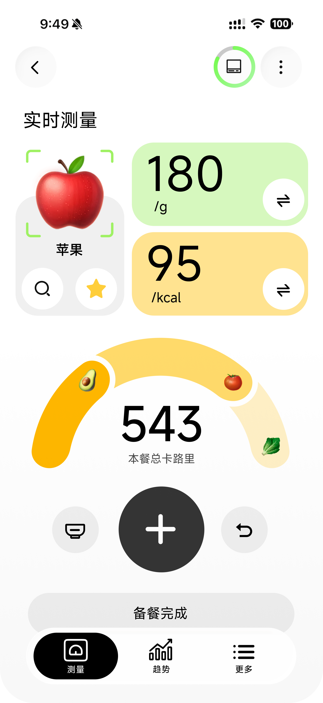
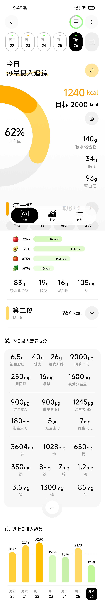
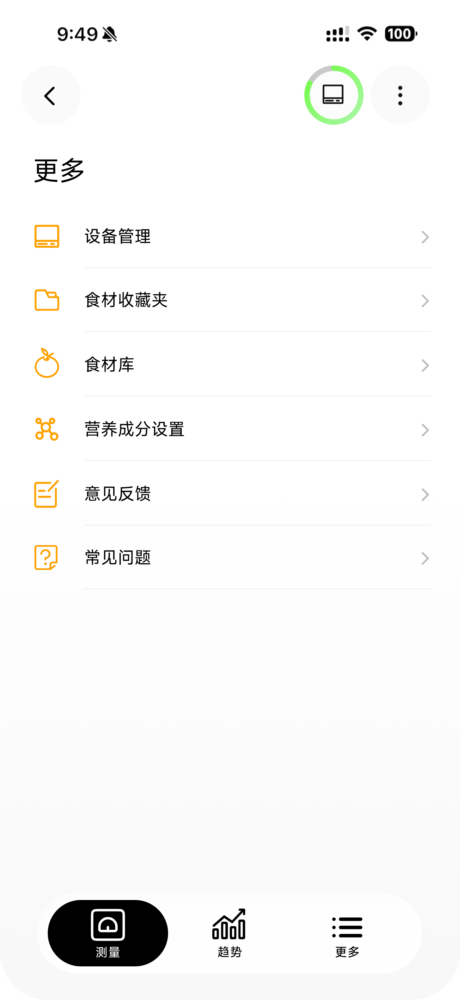

# Camera Nutrition Scale Reference

An early-stage, open-source reference implementation for the user experience of a camera-assisted nutrition scale. It explores how food recognition, load-cell measurements, nutrition feedback, and an embedded-device mental model can be expressed in one accessible mobile interface.

> Status: research prototype. All food, weight, recognition, battery, and nutrition data are simulated. This project is not a medical device and must not be used for diagnosis or dietary treatment.

## Why this project exists

Teams building connected scales often have to design across several boundaries at once: camera recognition, noisy weight readings, nutrition calculations, device state, mobile navigation, and firmware-driven motion. Public examples usually cover only one layer. This repository provides a runnable interaction reference that maintainers can study, test, and adapt without depending on proprietary hardware or assets.

The current interface is in Simplified Chinese because the initial research focuses on that user context. Localization is part of the roadmap.

## Included today

- Live-measurement flow with simulated recognition and weight changes
- Per-food and per-meal nutrition calculations using illustrative mock data
- Meal confirmation, tare, unit switching, favorites, and nutrition display settings
- Daily trend and goal views
- A floating scale simulator for testing without hardware
- Accessible labels and reduced reliance on color-only status
- Web, iOS, and Android targets through Expo

## Interaction evidence

These captures come from the runnable simulator in this repository; they do not depict a released consumer product or live hardware integration.

| Live measurement | Daily trends | Settings |
| --- | --- | --- |
|  |  |  |

[Product-flow map](docs/images/04-product-flow.png) · [Weighing flow](docs/motion/01-weighing-flow.mp4) · [Metric switch](docs/motion/02-metric-switch.mp4) · [Unit switch](docs/motion/03-unit-switch.mp4) · [Tare interaction](docs/motion/04-tare.mp4)

## Deliberately excluded

- Company product photographs, industrial-design files, internal PRDs, and firmware
- Production camera recognition or Bluetooth/Wi-Fi drivers
- Medical or clinically validated nutrition data
- User accounts, analytics, private datasets, and secrets

## Quick start

Requirements: Node.js 20.19 or newer, matching the Expo SDK 54 baseline.

```bash
npm ci
npm run web
```

Other useful checks:

```bash
npm run typecheck
npm run lint
```

## Project layout

```text
app/          Expo Router screens
components/   Shared UI and simulated application state
constants/    Mock foods, nutrition definitions, theme, and units
hooks/        Cross-platform hooks
docs/         Architecture and maintenance notes
```

See [ROADMAP.md](ROADMAP.md), [CONTRIBUTING.md](CONTRIBUTING.md), and [docs/architecture.md](docs/architecture.md) for the public maintenance plan and technical boundaries.

## Maintenance and AI-assisted workflow

The primary maintainer uses Codex for implementation support, issue triage, review checklists, regression-test planning, release notes, and synchronization between mobile interaction specifications and future embedded UI work. AI-generated changes must pass human review and the repository checks before merge. No confidential company material or user data should be sent to an AI service.

## Learning and community context

The project is maintained by student interns in a school-industry collaboration. In parallel with product research, the maintainers are leading practical AI-learning demonstrations for colleagues. This public repository is intended to be a reproducible teaching example for agent-assisted planning, implementation, review, and release workflows; it does not imply a commercial endorsement or a production deployment.

## License

Apache License 2.0. See [LICENSE](LICENSE) and [NOTICE](NOTICE).
